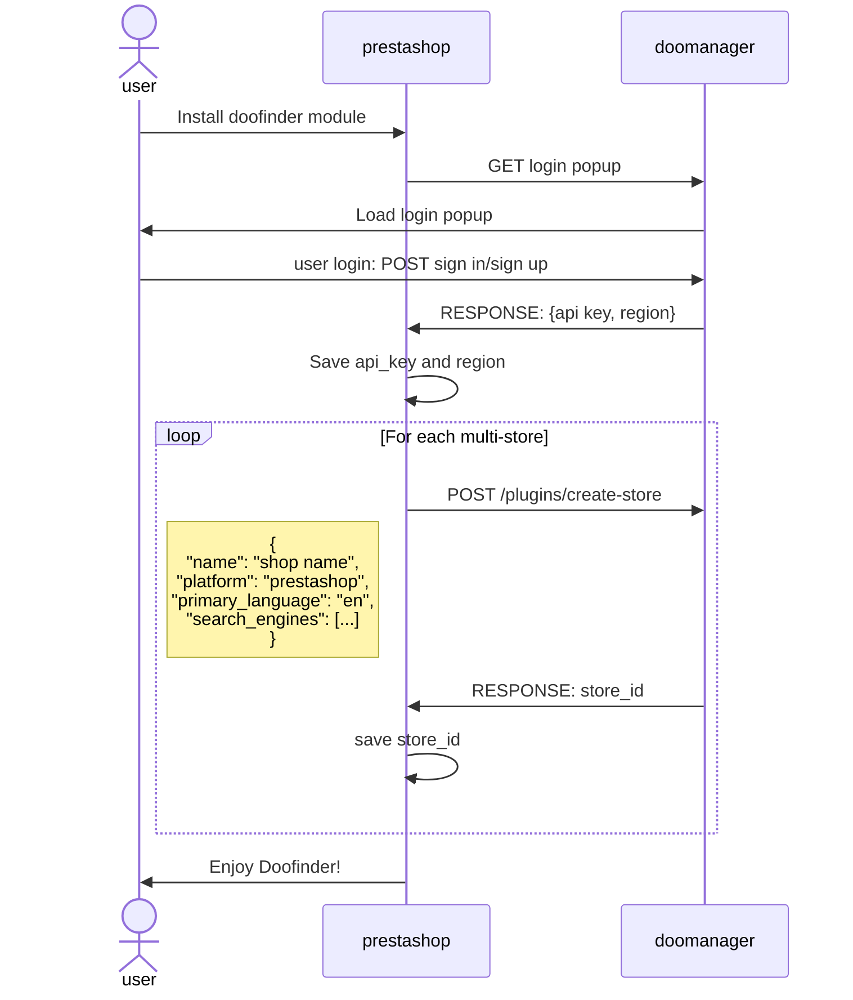
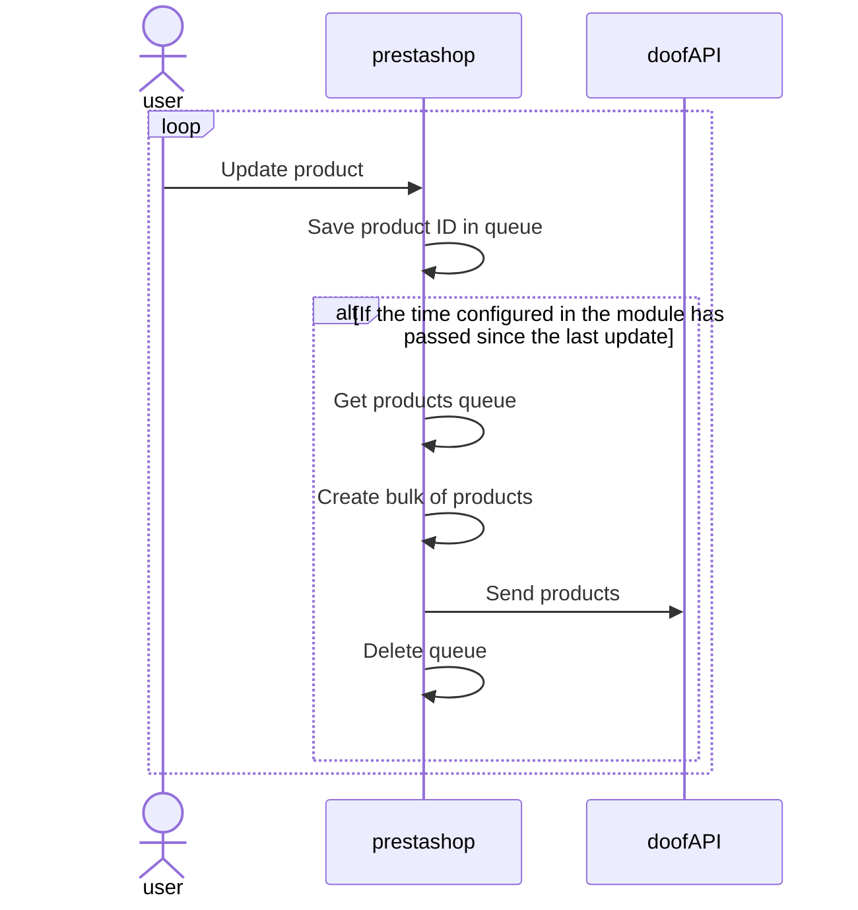
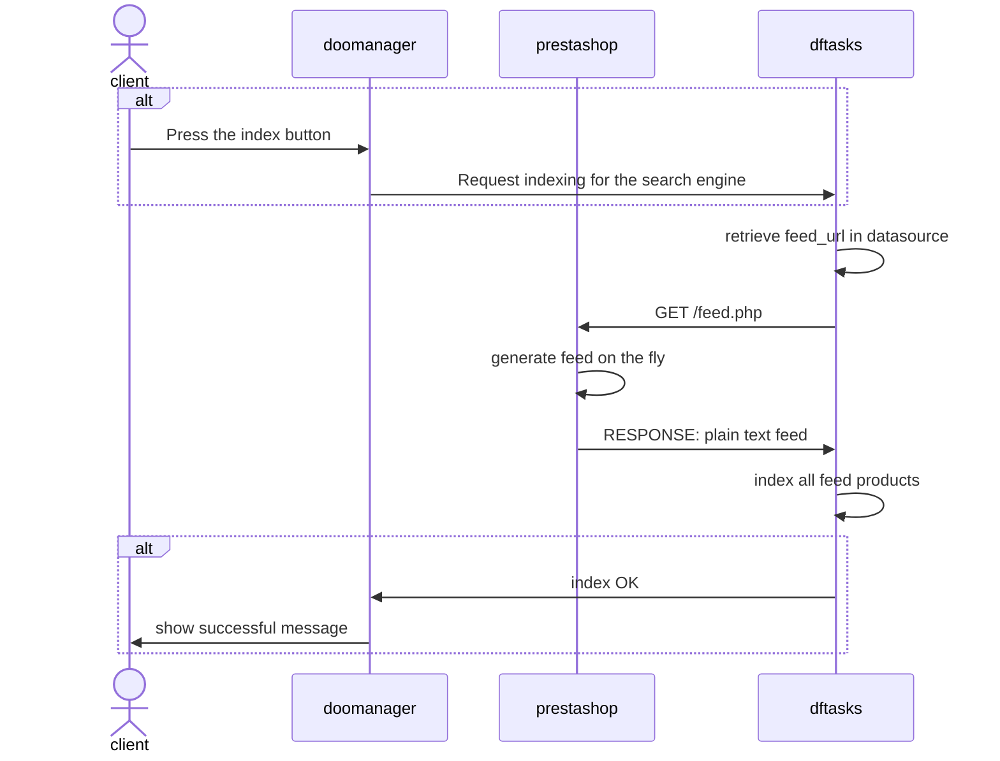

# Prestashop Architecture & Diagrams

## Diagrams

### Module installation process

```mermaid
sequenceDiagram
    actor user
    participant prestashop
    participant doomanager
    user->>prestashop: Install doofinder module
    prestashop->>doomanager: GET login popup
    doomanager->>user: Load login popup
    user->>doomanager: user login: POST sign in/sign up
    doomanager->>prestashop: RESPONSE: {api key, region}
    prestashop->>prestashop: Save api_key and region
    loop For each multi-store
        prestashop->>doomanager: POST /plugins/create-store
        Note left of prestashop: {<br> "name": "shop name",<br> "platform": "prestashop",<br> "primary_language": "en",<br> "search_engines": [...]<br> }
        doomanager->>prestashop: RESPONSE: store_id
        prestashop->>prestashop: save store_id
    end
    prestashop->>user: Enjoy Doofinder!
```

### Update on save

```mermaid
sequenceDiagram
    actor user
    participant prestashop
    participant doofAPI
    loop
        user->>prestashop: Update product
        prestashop->>prestashop: Save product ID in queue
        alt If the time configured in the module has passed since the last update
            prestashop->>prestashop: Get products queue
            prestashop->>prestashop: Create bulk of products
            prestashop->>doofAPI: Send products
            prestashop->>prestashop: Delete queue
        end
    end
```

### Indexing via feed

```mermaid
sequenceDiagram
    actor client
    participant doomanager
    participant prestashop
    participant dftasks

    alt
        client->>doomanager: Press the index button
        doomanager->>dftasks: Request indexing for the search engine
    end
    dftasks->>dftasks: retrieve feed_url in datasource
    dftasks->>prestashop: GET /feed.php
    prestashop->>prestashop: generate feed on the fly
    prestashop->>dftasks: RESPONSE: plain text feed
    dftasks->>dftasks: index all feed products
    alt
        dftasks->>doomanager: index OK
        doomanager->>client: show successful message
    end
```